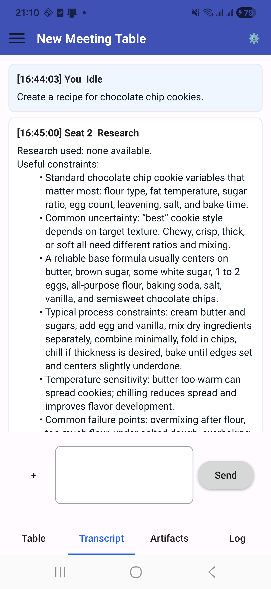

# AI Meeting Table
### Powerful native Windows and Android application that coordinates multiple AI models through a structured meeting workflow.

Version 1.0.0 is the current source baseline. The Windows application uses Qt Widgets. The Android application uses Qt Quick and targets arm64 devices running Android 9 or newer.

Prebuilt Windows packages are available from [GitHub Releases](https://github.com/noobieisgod/AI-Meeting-Table/releases). Android production signing and store publishing remain manual.



## Features

- OpenAI, Google Gemini, and Anthropic provider support
- Configurable model seats and collaboration roles
- Research, planning, execution, quality-control, and presentation phases
- Final Decision Maker arbitration
- Shared transcript, event log, attachments, and evolving artifacts
- Token, round, loop, and time limits
- Local persistence and pause, resume, continuation, and follow-up flows

## Requirements

- CMake 3.21 or newer
- A C++20 compiler
- Qt 6.8 or newer
- Windows: Qt Widgets, SQL, and Network modules with MSVC 2022
- Android: Qt Quick, Quick Controls, SQL, and Network modules, Android SDK 36, NDK 27.2, and JDK 17

## Build and test

Windows:

```powershell
cmake -S . -B build/windows -A x64 -DBUILD_TESTING=ON
cmake --build build/windows --config Release
ctest --test-dir build/windows -C Release --output-on-failure
```

Android:

```powershell
& "$env:QT_ROOT_DIR\bin\qt-cmake.bat" -S . -B build/android -G Ninja `
  -DANDROID_SDK_ROOT="$env:ANDROID_SDK_ROOT" `
  -DANDROID_NDK_ROOT="$env:ANDROID_NDK_ROOT" `
  -DCMAKE_BUILD_TYPE=Release -DBUILD_TESTING=OFF
cmake --build build/android --target AIMeetingTable
```

See [Building](docs/BUILDING.md), [Testing](docs/TESTING.md), and [Architecture](docs/ARCHITECTURE.md) for details.

## API keys and privacy

Windows stores provider credentials with Windows Credential Manager. Android stores them through an Android Keystore-backed bridge. Supported builds send prompts, selected conversation context, and user-selected attachments directly to the configured AI provider over HTTPS. The project does not operate an intermediary backend.

Review the [privacy policy](https://noobieisgod.github.io/AI-Meeting-Table/) before using provider credentials or sensitive material. Report security concerns according to [SECURITY.md](SECURITY.md).

## Contributing

Read [CONTRIBUTING.md](CONTRIBUTING.md) before submitting a change. Generated build directories, release archives, signing material, credentials, and local databases must not be committed.

## License

AI Meeting Table is licensed under the [MIT License](LICENSE).
